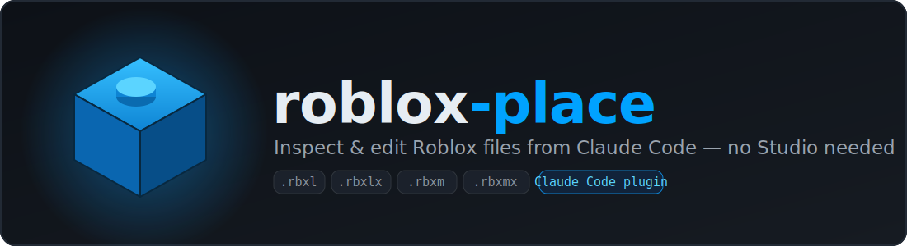
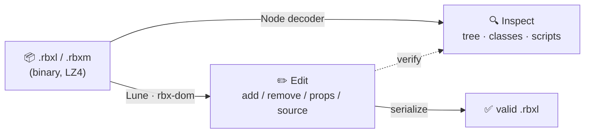

<div align="center">



### Inspect & edit Roblox place and model files from Claude Code — **without opening Roblox Studio**

[](#-license)
[](https://claude.com/claude-code)
[](https://nodejs.org)
[](https://lune-org.github.io/docs)


*A `.rbxl` file is normally an opaque, LZ4-compressed binary blob.*
*This plugin turns it into a readable tree you can inspect — and safely edit — in plain English.*

</div>

---

## ✨ What it does

Talk to Claude Code about a saved Roblox file and it just happens:

> 💬 *"What's inside this `.rbxl`? Show me the tree."*
> 💬 *"Extract all the scripts from this place."*
> 💬 *"Add a server Script called `Bootstrap` to ServerScriptService."*
> 💬 *"Change the Baseplate's transparency to 0.5 and rename `Model` to `Arena`."*

No manual unpacking, no Studio round-trip, no hand-editing binary.

---

## 🚀 Quick start

```text
# 1) Add this repo as a plugin marketplace
/plugin marketplace add vanyaby/Roblox-x-claudeskill

# 2) Install the plugin
/plugin install roblox-place@roblox-tools

# 3) Turn the mode on (it asks whether to back up first), then just talk
/roblox-on
```

When you're done: `/roblox-off`.

> **Prefer a skill over a plugin?** Copy `skills/roblox-place/` into `~/.claude/skills/`.

---

## 🎮 Commands

| Command | What it does |
|---------|--------------|
| **`/roblox-on`** | Starts Roblox mode for the session. **Asks whether to back up the game file before edits** (every time), then routes any `.rbxl`/`.rbxm` work through the skill until you stop. |
| **`/roblox-off`** | Stops Roblox mode for the session. |

The skill **never engages on its own** — you switch it on and off explicitly.

---

## 🧩 How it works

Two engines, picked automatically for the job:



- **🔍 Node decoder** (`scripts/rbxl_decode.js`) — a dependency-free reader of the binary
  format (LZ4 chunks, `INST`/`PROP`/`PRNT`, zig-zag + delta referents). Prints the tree,
  lists classes, extracts every script's Lua source. **Read-only** — used for inspection
  and to *verify* edits.
- **✏️ Lune** (`@lune/roblox`, i.e. **rbx-dom**) — a standalone Luau runtime that safely
  reads and writes the files using the same API you'd use inside Studio
  (`Instance.new`, `.Parent`, properties). Fetched automatically on first edit.

---

## 👀 What inspection looks like

Point the decoder at a place and you get its full Explorer tree back:

```text
=== HEADER ===
format version : 0
class count    : 14
instance count : 27

=== INSTANCE TREE ===
└─ Workspace [Workspace]
   ├─ Baseplate [Part]
   ├─ SpawnLocation [SpawnLocation]
   └─ Model [Model]
      ├─ Humanoid [Humanoid]
      └─ Head [Part]
├─ Lighting [Lighting]
│  └─ Atmosphere [Atmosphere]
├─ ReplicatedStorage [ReplicatedStorage]
│  └─ Modules [Folder]
│     └─ Config [ModuleScript]
└─ ServerScriptService [ServerScriptService]
   └─ Main [Script]
```

Every script's source is dropped into `<file>.scripts/` as `.lua`, and the whole tree is
saved as `<file>.tree.json`.

---

## 🛟 Safety first

- **Backup, then edit in place.** Edits go back to your **main file**, so you keep opening
  the same one — but a timestamped backup (`place.backup-YYYYMMDD-HHMMSS.rbxl`) is made
  first as the safety net. (Writing to a separate output file is still available on request.)
- **Lock-aware.** If a `<file>.lock` shows Studio has the file open, the skill **refuses to
  edit in place** — close Studio first, since an in-place write would be lost on Studio's
  next save.
- **Verified after writing.** Every edit is re-read with the decoder to confirm it landed
  and the tree is still intact.

> Lune **edits files; it does not run the game.** To playtest, open the result in Studio.

---

## 📋 Requirements

- **Node.js** — for the decoder and the Lune bootstrap.
- **Lune** — downloaded automatically on first edit (or set `LUNE_BIN` to your own install).
- **Internet** on first run only (to fetch Lune), unless Lune is already installed.

---

## 🗂️ Project structure

```text
roblox-place-plugin/
├── .claude-plugin/
│   ├── plugin.json            # plugin manifest
│   └── marketplace.json       # makes this repo installable as a marketplace
├── commands/
│   ├── roblox-on.md           # /roblox-on  — start (asks about backups)
│   └── roblox-off.md          # /roblox-off — stop
└── skills/roblox-place/
    ├── SKILL.md               # the instructions Claude follows
    ├── scripts/
    │   ├── rbxl_decode.js      # binary reader / inspector
    │   └── ensure_lune.js      # locate or download Lune
    ├── assets/templates/       # parameterized Luau edit scripts
    │   ├── inspect.luau
    │   ├── add_instance.luau
    │   ├── edit_source.luau
    │   ├── set_property.luau
    │   └── remove_instance.luau
    └── references/
        ├── lune-api.md         # the Lune roblox API + gotchas
        └── binary-format.md    # the .rbxl binary format, documented
```

---

## 🧪 Supported formats

| Format | Inspect | Edit |
|--------|:-------:|:----:|
| `.rbxl` (place, binary) | ✅ decoder + Lune | ✅ Lune |
| `.rbxlx` (place, XML) | ✅ Lune | ✅ Lune |
| `.rbxm` (model, binary) | ✅ Lune | ✅ Lune |
| `.rbxmx` (model, XML) | ✅ Lune | ✅ Lune |

---

## 📄 License

[MIT](LICENSE) — do what you like, no warranty.

<div align="center">

<sub>Built for <a href="https://claude.com/claude-code">Claude Code</a> · powered by <a href="https://github.com/lune-org/lune">Lune</a> &amp; <a href="https://github.com/rojo-rbx/rbx-dom">rbx-dom</a></sub>

</div>
